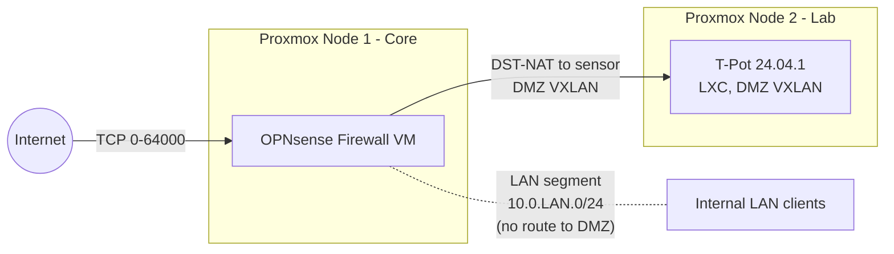
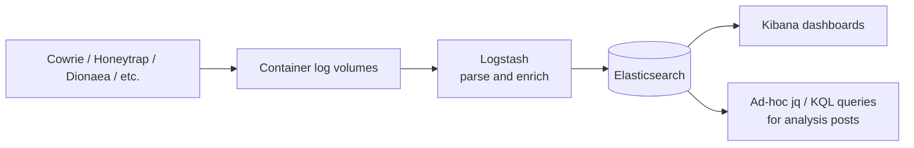

> **TL;DR**
> - Deployed T-Pot 24.04.1 as an LXC container on a dedicated Proxmox lab node, isolated in a DMZ VXLAN behind an OPNsense firewall.
> - All TCP ports 0–64000 are DST-NAT'd from the public interface to the sensor, exposing the full T-Pot service stack to the internet.
> - Hardened Cowrie's deception surface with a custom `honeyfs/`, a realistic enterprise hostname pattern, and a believable Ubuntu 22.04 / OpenSSH 8.9p1 fingerprint.
> - First event captured 2026-04-13T18:41:31Z. Cumulative volume across ~21 days is dominated by Honeytrap (991k) and Cowrie (482k).
> - This post is the lab cornerstone and a reference for follow-up posts that will analyze the data.
{: .prompt-tip }

## Why a Honeypot Lab

I am transitioning from a sysadmin role with cybersecurity responsibilities into a Security Operations Center (SOC) analyst track. Reading detection content is not the same as having to triage it. A T-Pot deployment exposed to the public internet generates a continuous, real-world stream of opportunistic attack telemetry that I can use to:

- Practice triage on volumes a homelab can realistically sustain.
- Build, test, and tune detection content (Sigma, Suricata, KQL) against real adversary behavior rather than synthetic test data.
- Maintain a public, reproducible portfolio of analysis.

This post documents the deployment so the analysis posts that follow have a single canonical reference for the environment.

## Environment

> Sensor: T-Pot 24.04.1 (full edition, all honeypots enabled)
> Host: Proxmox VE 9.1.7, dedicated lab node
> LXC resources: 2 vCPU, 16 GiB RAM, 125 GiB disk, single VXLAN-attached NIC
> Perimeter: OPNsense VM on a separate Proxmox node
> Exposure: DST-NAT, TCP 0–64000 → sensor
> Collection window referenced in this post: 2026-04-13T18:41:31Z → 2026-05-04T00:00:00Z (~21 days)
{: .prompt-info }

> Honeypot data is biased toward opportunistic, internet-wide scanning and commodity malware. Findings drawn from this sensor should not be extrapolated to targeted-threat baselines or to internal east-west traffic.
{: .prompt-warning }

## Lab Topology

The lab spans two Proxmox nodes. Production-style services (firewall, DNS, media, storage) live on the main node. Anything experimental or intentionally exposed lives on a second, isolated node. Only the perimeter firewall and the sensor are relevant to this post; other VMs are omitted from the diagram for clarity.



Two design choices worth flagging:

1. **The sensor is on a separate Proxmox node from the firewall.** A compromise of the LXC container should not give the attacker a foothold on the same hypervisor as my core services. The two nodes communicate over a VXLAN overlay, but the DMZ has no route to the LAN segment.
2. **The DMZ is a VXLAN, not a flat VLAN.** This keeps the broadcast domain isolated from the rest of the lab fabric and makes it trivial to extend to additional sensors without re-cabling.

> The DMZ has no return path to the LAN. The OPNsense rule set permits only inbound DST-NAT to the sensor and explicit egress for sensor updates and image pulls. Egress filtering is critical: a misconfigured honeypot can become an outbound attack platform.
{: .prompt-danger }

## Exposure: Why 0–64000

The default T-Pot footprint binds dozens of services across a wide port range. Honeytrap in particular acts as a low-interaction catch-all that can dynamically respond on arbitrary TCP ports. To let the sensor see the full opportunistic-scanning surface — rather than only the canonical ports — I DST-NAT TCP 0–64000 from the OPNsense WAN to the sensor.

Ports 64001–65535 are intentionally excluded so I retain headroom for management and out-of-band tooling on the firewall itself.

> If you replicate this, do not enable IPS mode on the WAN-facing OPNsense interface for the DST-NAT'd range. Suricata in blocking mode will silently drop the very traffic the honeypot exists to collect.
{: .prompt-warning }

## Cowrie Hardening

Out-of-the-box Cowrie is fingerprintable. The default hostname (`svr04`), the default filesystem pickle, and the default banner are well known to attacker tooling and to public Shodan/Censys scans. A sensor that announces itself as a honeypot collects less interesting data because skilled operators disconnect on first contact.

I made two categories of changes: the deception identity (`cowrie.cfg`) and the deception filesystem (`honeyfs/`).

### Deception identity

Selected fields from `etc/cowrie.cfg`{: .filepath }, with the values that matter for fingerprinting:

```ini
[honeypot]
hostname = srv-<role>-<env>-01
auth_class = UserDB
userdb_file = etc/userdb.txt
timezone = Europe/London

[shell]
arch = linux-x64-lsb
kernel_version = 5.15.0-91-generic
kernel_build_string = #101-Ubuntu SMP Tue Nov 14 13:30:08 UTC 2023
hardware_platform = x86_64
operating_system = GNU/Linux
ssh_version = OpenSSH_8.9p1, OpenSSL 3.0.2 15 Mar 2022

[ssh]
version = SSH-2.0-OpenSSH_8.2p1 Ubuntu-4ubuntu0.11
ciphers = aes128-ctr,aes192-ctr,aes256-ctr,aes256-cbc,aes192-cbc,aes128-cbc,3des-cbc
macs = hmac-sha2-512,hmac-sha2-256,hmac-sha1
auth_attempts = 5
```
{: file="etc/cowrie.cfg" }

Reasoning, field by field:

- **`hostname`** follows a `srv-<role>-<env>-NN` pattern that mirrors how a real corporate sysadmin labels production hosts. The published pattern here is genericized; the actual sensor uses a specific role and environment that I am keeping out of the post to preserve the deception value.
- **`Kernel` and `OS` strings** are aligned to a plausible Ubuntu 22.04 LTS host. Cowrie defaults are older and easy to flag.
- **`ssh_version`** in `[shell]` and `version` in `[ssh]` are deliberately set to two different but consistent OpenSSH builds. Real Ubuntu hosts will report the packaged build in the SSH banner; the in-shell `ssh -V` output is what an attacker sees after login. Keeping these consistent with a real Ubuntu 22.04 system reduces fingerprinting.
- **`ciphers` and `macs`** are restricted to a set that a hardened-but-not-paranoid production server would actually negotiate. The Cowrie default cipher list is broader than reality and is itself a tell.
- **`auth_attempts = 5`** mirrors typical production `MaxAuthTries`. The Cowrie default invites unrealistic password floods.

### Deception filesystem

I replaced the default `honeyfs/` with a hand-curated tree:

```text
honeyfs/
├── etc/
│   ├── group
│   ├── host.conf
│   ├── hostname
│   ├── hosts
│   ├── inittab
│   ├── issue
│   ├── motd
│   ├── passwd
│   ├── resolv.conf
│   └── shadow
└── proc/
    ├── cpuinfo
    ├── meminfo
    ├── modules
    ├── mounts
    ├── net/
    │   └── arp
    └── version
```

Each file is populated with content consistent with the declared kernel and OS version. The point is not to fool a sophisticated operator indefinitely — it is to survive the first 30 seconds of reconnaissance commands (`uname -a`, `cat /etc/os-release`, `cat /proc/cpuinfo`, `cat /etc/passwd`) that commodity scripts run before deciding whether to drop a payload.

> The realism bar I am aiming for is "survives an automated dropper's pre-flight checks," not "fools a human red teamer." Most of the value of a honeypot at this volume comes from automated traffic, and automated tooling rarely looks past the first handful of recon commands.
{: .prompt-info }

## Pipeline Overview

T-Pot's internal pipeline is unchanged from the upstream 24.04.1 build. Each honeypot writes structured logs that are shipped via Logstash into the bundled Elasticsearch instance and visualized in Kibana.



For analysis posts I will work primarily from Kibana for visualization and from raw `cowrie.json` and Elasticsearch queries for anything that needs to be reproducible.

## Initial Volume Snapshot

First event observed: 2026-04-13T18:41:31Z. Cumulative event counts across the ~21-day window, by sensor:

| Sensor     |   Events |
|------------|---------:|
| Honeytrap  |  991k |
| Cowrie     |  482k |
| Sentrypeer |  318k |
| Dionaea    |  206k |
| Mailoney   |   31k |
| Heralding  |   25k |
| Tanner     |   12k |
| Adbhoney   |    9k |
| H0neytr4p  |    7k |
| ConPot     |    4k |

> Counts are rounded and reflect the cumulative window from first event to publication. Honeytrap dominates because it acts as a generic TCP catch-all across the full DST-NAT'd range; one Honeytrap event does not equate to one meaningful interaction. Sentrypeer's volume is consistent with the SIP scanning visible in the port distribution below (UDP/TCP 5060). Note that Honeytrap and H0neytr4p are distinct tools: Honeytrap is the catch-all TCP responder, while H0neytr4p is a separate HTTP-focused honeypot.
{: .prompt-info }

{: w="800" h="450" .shadow }
_T-Pot Kibana overview, 2026-04-13 → 2026-05-04 UTC. 2M events, top sensor (omitting Honeytrap): Cowrie, top source country: United States._

{: w="800" h="450" .shadow }
_T-Pot live attack map._

## Top Ports and Credentials

A read of the highest-signal credential and port telemetry across the 21-day window. The dedicated Cowrie deep dive will publish the full IoC CSV, daily breakdowns, and a Sigma rule; this section is scoped to what is needed to sanity-check the lab and orient follow-up analysis.

### Top usernames (Cowrie)

| Username           |  Count |
|--------------------|-------:|
| `root`             | 57,125 |
| `ubuntu`           |  2,419 |
| `sa`               |  1,873 |
| `345gs5662d34`     |  1,217 |
| `admin`            |  1,118 |
| `postgres`         |    714 |
| `deploy`           |    594 |
| `user`             |    567 |
| `test`             |    526 |
| `ftpuser`          |    323 |

`root` outweighs the next entry by more than 23×, which is consistent with commodity SSH/Telnet brute-force tooling that does not vary the username. The presence of `sa` (Microsoft SQL Server's default sysadmin account) and `postgres` in the top 10 suggests scanners are probing Cowrie expecting a database-host fingerprint, which is useful confirmation that the deception identity is at least plausible at the credential layer. The string `345gs5662d34` is a long-documented default credential associated with embedded-device firmware seen in IoT botnets; it appears as both a username and a password in this dataset, which is the canonical signature of that scanner family.

### Top passwords (Cowrie)

| Password           |  Count |
|--------------------|-------:|
| _(empty)_          |  1,752 |
| `123456`           |  1,498 |
| `3245gs5662d34`    |  1,238 |
| `345gs5662d34`     |  1,217 |
| `admin`            |    604 |
| `123`              |    570 |
| `password`         |    453 |
| `12345678`         |    332 |
| `1234`             |    292 |
| `12345`            |    224 |
| `P@ssw0rd`         |    223 |
| `nPSpP4PBW0`       |    114 |

The empty password is the single most common value, indicating that a meaningful share of inbound traffic is probing for null-authentication misconfigurations rather than guessing credentials. `nPSpP4PBW0` and the `345gs5662d34` family are pre-canned strings from specific scanner builds, not creative attempts. A handful of entries in the long tail of the export are not credentials at all but HTTP request fragments (`GET / HTTP/1.1`, `Accept: */*`, `Host: <sensor-public-ip>:23`) — the result of HTTP scanners hitting the Telnet port and Cowrie parsing the request line as a username/password pair. That artifact is itself useful for detection content: any auth attempt where the credential field contains an HTTP method or header is, by definition, malformed protocol traffic and a high-confidence indicator of indiscriminate scanning.

> The `<sensor-public-ip>` placeholder above stands in for an IP that appeared in scanner-supplied HTTP Host headers and is being treated as sensitive infrastructure data until verified otherwise.
{: .prompt-warning }

### Top destination ports by source country

| Country       | Dest. Port |   Count |
|---------------|-----------:|--------:|
| United States |       5060 | 286,911 |
| Spain         |      45184 |  56,917 |
| United States |         22 |  22,459 |
| China         |         22 |  22,043 |
| China         |        445 |  18,871 |
| Spain         |       6089 |  12,328 |
| United States |         23 |  10,869 |
| Netherlands   |         25 |   7,147 |
| United States |       8728 |   6,863 |
| Netherlands   |       5060 |   5,400 |
| United States |      28853 |   5,146 |
| Spain         |        445 |   3,149 |
| Germany       |        445 |   3,173 |
| Netherlands   |         23 |   3,178 |
| Spain         |      55912 |   2,926 |
| China         |      28853 |   2,635 |
| Germany       |       5060 |   2,390 |
| Netherlands   |      17000 |   2,107 |
| Germany       |         25 |   1,869 |
| Germany       |         22 |   1,476 |
| Germany       |         23 |   1,393 |
| Netherlands   |       9100 |   1,534 |
| Spain         |      32924 |   1,371 |
| China         |       1433 |   1,167 |
| China         |         23 |   1,277 |

A few patterns are worth pulling out for downstream analysis:

- **Port 5060 (SIP) from the United States dominates the entire dataset** at 287k events, which directly explains Sentrypeer's third-place position in the sensor table. This is consistent with public reporting on SIPVicious-family VoIP fraud reconnaissance and is the strongest single signal in the lab so far.
- **Port 8728 (MikroTik RouterOS API) and port 28853** appear from US sources at non-trivial volume. RouterOS API targeting is a well-documented vector; 28853 is less common and warrants a follow-up post.
- **China-sourced traffic concentrates on 22 (SSH), 445 (SMB), and 1433 (MSSQL)** — the canonical credential-brute-force triplet. This aligns with the `sa` and `root` username distribution above.
- **Spain accounts for an outsized share of high-numbered ports** (45184, 55912, 32924, 6089). These do not map cleanly to common services and likely reflect either ephemeral-port responder traffic, a regional scanner population, or honeypot proximity to the source. I am flagging this as an open question rather than drawing a conclusion.

A downloadable CSV of the full IoC set (top 50 usernames, top 50 passwords, complete country/port matrix) will ship with the Cowrie deep-dive post.

## Detection Engineering Hooks

This post is a lab build, so the artifact it ships is the deployment itself. Concrete detection content lands in the analysis posts that follow. Planned next artifacts:

- A Sigma rule for credential-stuffing patterns observed against the sensor.
- A Suricata signature tuned for the specific Mirai-family scanner behavior visible in Honeytrap.
- A KQL query, written for Microsoft Sentinel, that translates honeypot-derived IoCs into a watchlist-driven detection.

## Limitations

- **Single sensor, single network vantage.** All conclusions drawn from this data are about traffic that reaches one residential broadband IP. They are not representative of enterprise-edge or cloud-edge baselines.
- **No ground truth on attribution.** Source IPs and ASNs can be reported, but attribution to named threat actors is not possible from this data alone and will not be claimed.
- **Honeytrap inflation.** Honeytrap's catch-all behavior generates a much higher event count per actual attacker session than Cowrie or Dionaea. Sensor-to-sensor comparisons need to account for this.
- **Cumulative window.** The volume snapshot is cumulative since first event, not a rolling 24-hour figure. Daily figures will appear in the analysis posts.

## References

- T-Pot Community Edition — <https://github.com/telekom-security/tpotce>
- Cowrie SSH/Telnet honeypot — <https://github.com/cowrie/cowrie>
- Proxmox VE — <https://www.proxmox.com/en/proxmox-virtual-environment/overview>
- OPNsense — <https://opnsense.org/>
- MITRE ATT&CK — <https://attack.mitre.org/>

## Changelog

- 2026-05-04 — Initial publication.

_See the [about page](/about/) for this site's AI assistance policy._